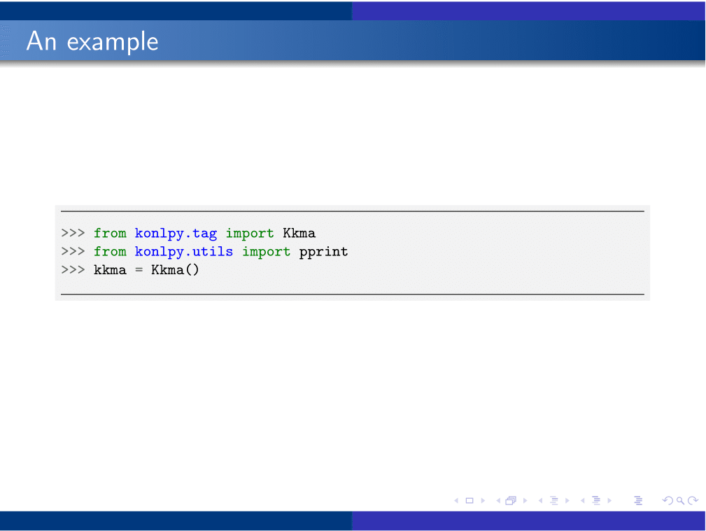
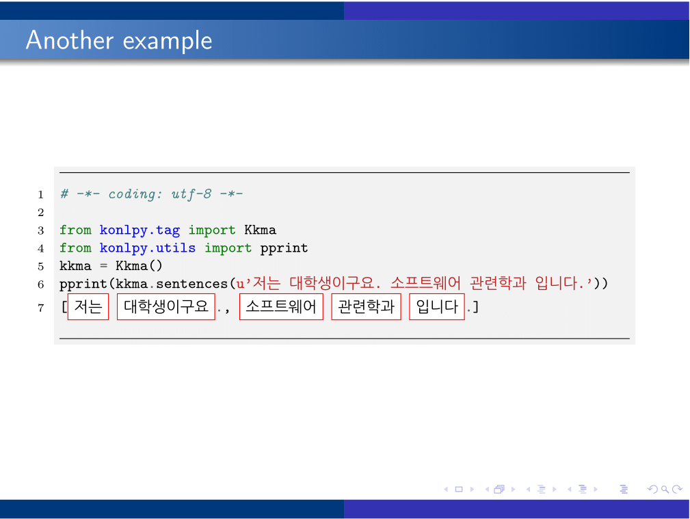

# SNUbeam

Unofficial LaTex beamer theme for Seoul National University

## Run

Run ``pdflatex`` once. If you include code blocks (i.e., use package ``minted``), run with ``-shell-escape`` enabled.

    $ pdflatex example.tex; open example.pdf
    $ pdflatex -shell-escape code.tex; open code.pdf

## Screenshots

### example.tex

### code.tex

## License

GPL v3 (or above)

## References

- [SNU Ph.D. Thesis format](http://ids.snu.ac.kr/wiki/Writing_a_Thesis_in_SNU_Format_Using_LaTex) by IDS Lab
- [SNU M.S. Thesis format](http://kenshin579.tistory.com/tag/SNU%20thesis%20latex%20template) by kenshin579
- [SNU Undergrad Thesis format](https://github.com/zeta709/snuthesis) by zeta709
